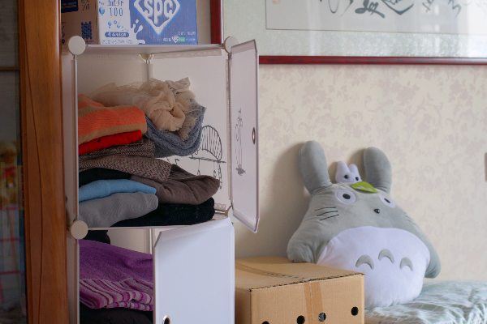
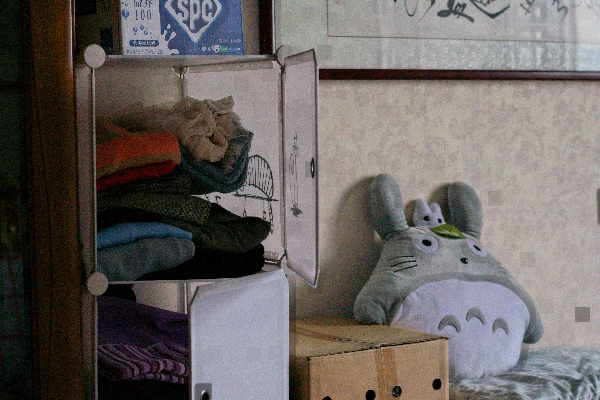

# Finished

## 1 Traditional Methods
### 1.1 Histogram Equalization (HE)
### 1.2 Adaptive Histogram Equalization (AHE)
### 1.3 Contrast Limited Adaptive Histogram Equalization (CLAHE)
### 1.4 Ablation Study

## Dehazing-based Low-Light Image Enhancement

Inspired by the observation that the inverted form of a low-light image resembles a hazy image, we implemented a dehazing-based method to enhance low-light images. This approach is motivated by the paper *"Fast Efficient Algorithm for Enhancement of Low Light Video"* and leverages the classic Dark Channel Prior (DCP) dehazing technique.

## Results and Visualization

We compare three versions of the image:

- **Left**: Original low-light input  
- **Middle**: Ground truth or reference high-brightness image  
- **Right**: Our dehazing-enhanced result

  

    
    
Low-light Input

  

  

    
    
Original Bright Image

  

  

    
    
Dehazing-based Enhanced

  

As shown above, our method significantly improves the brightness and visibility in dark regions. While minor color shifts may occur due to atmospheric light estimation, the result offers a clear enhancement in terms of detail and contrast.

# Next Stage
## Evaluation Methods
- One Next Stage is to finish the evaluation pipiline and evaluate all the methods
