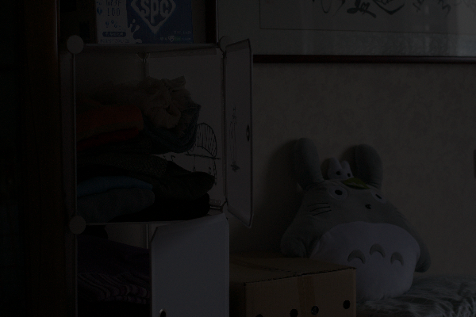

# Finished

## 1 Traditional Methods

In our proposal, we plan to implement traditional methods for image enhancement in low-light conditions as a baseline for comparison with other advanced approaches. Specifically, we aim to implement methods based on histogram equalization and Retinex theory. So far, we have completed the **histogram equalization** part. Experiments have been conducted on the dataset, and ablation studies have been carried out to investigate the impact of different factors on image enhancement performance.

### Results and Visualization

- **Histogram Equalization (HE)**
  
  HE enhances images by performing global contrast stretching. Since HE is applied to grayscale images, different color models may yield different results. Therefore, we examined the performance of HE under two color models: RGB and HSV.

  For the RGB model, HE was applied separately to each of the three channels, and the enhanced channels were then merged. For the HSV model, HE was applied only to the V channel, while the H and S channels were kept unchanged. The experiments for AHE and CLAHE presented in the following parts also follow this procedure. 

  We have tested the performance of HE on the dataset. Some of the results are presented below,

  

  In the figure, the left and the last columns represent the input low-light image and the corresponding ground truth bright image. The second and third columns show the results of HE applied under RGB and HSV model respectively. It can be seen that HE demonstrates satisfying performance under both the color models. However, it tends to over-amplify noise and, in some cases, also exhibits an **overexposed appearance** which is more obvious under the RGB model.

- **Adaptive Histogram Equalization (AHE)**

  AHE applies HE to local areas instead of the entire image. In our implementation, we use the original version of AHE, in which HE is applied to the local neighborhood of each pixel, and the result at the center pixel is taken as the output. The neighborhood size is set to 64. Some of the results are presented below,

  

  It can be observed that AHE does not perform as well as HE on the two example images. Since histogram equalization is performed within a limited neighborhood, visible artifacts are introduced, and noise is significantly amplified. As a result, AHE is **sensitive to noise**. Moreover, the **computational cost** of AHE is considerably higher, as it requires computing a separate histogram for the neighborhood of each individual pixel.

- **Contrast Limited Adaptive Histogram Equalization (CLAHE)**

  CLAHE improves AHE by introducing a contrast limit and bilinear interpolation. In our implementation, we set the contrast limit to 3, as a value between 2 and 5 is commonly recommended. Some of the results are presented below,

  

  It can be observed that CLAHE demonstrates satisfying performance. Compared to AHE, the introduction of a contrast limit effectively **suppresses noise amplification**, while the use of bilinear interpolation enhances spatial consistency in the image. Compared to HE, CLAHE does not suffer from the problem of overexposure.
  
  Furthermore, there is no significant difference in performance between applying CLAHE under the RGB and HSV color models, which demonstrates the robustness of this method. However, it is worth noting that the use of a contrast limit can cause the output images to appear slightly darker. Setting contrast limit to a higher value can mitigate this effect, but it may, in turn, amply noise, which highlights a **trade-off between brightness and noise control**.

### Ablation Study

  CLAHE divides the image into multiple non-overlapping sub-regions (tiles) and applies histogram equalization independently to each region. In this method, **bilinear interpolation** plays a crucial role as it can enhance the smooth transition between tiles and thus improve spatial consistency. In this part, we investigate the effect of interpolation in CLAHE by conducting experiments with or without bilinear. The results are shown in the figures below.

 

 It can be observed that without interpolation, the images in the first row exhibit a blocky, “mosaic-like” appearance, where each block corresponds to a tile used in CLAHE. With interpolation is enabled, the spatial consistency of the image is significantly improved, resulting in a more visually coherent and unified output.

## 2 Dehazing-based Low-Light Image Enhancement

Inspired by the observation that the inverted form of a low-light image resembles a hazy image, we implemented a dehazing-based method to enhance low-light images. This approach is motivated by the paper *"Fast Efficient Algorithm for Enhancement of Low Light Video"* and leverages the classic Dark Channel Prior (DCP) dehazing technique.

### Results and Visualization

We compare three versions of the image:

- **Left**: Original low-light input  
- **Middle**: Ground truth or reference high-brightness image  
- **Right**: Our dehazing-enhanced result

  

    
    
Low-light Input

  

  

    
    
Original Bright Image

  

  

    
    
Dehazing-based Enhanced

  

As shown above, our method significantly improves the brightness and visibility in dark regions. While minor color shifts may occur due to atmospheric light estimation, the result offers a clear enhancement in terms of detail and contrast.

# Next Stage
## Evaluation Methods
- One Next Stage is to finish the evaluation pipiline and evaluate all the methods
