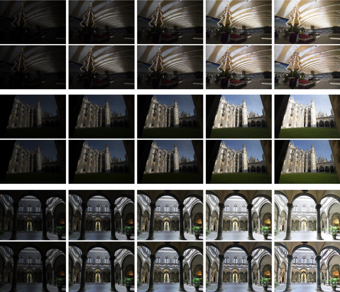

# Lighting up my World

by Michael Carlstrom (rmc170), Wang Yang (wxy320), Chenxing Liu (cxl1697)

## 1 Project Overview:

The project goal is to create and evaulate various methods of enhancing images in low-light conditions.

Typically by default when an image is taken it stores the raw rgb values in the image. To the human eye our perception struggles to determine sublte differenes so objects that are geuniley a different color can easily get lost in a dark image. Using image processing and machine learning tools can help overcome human eye limitations and make images more presentable to humans.

This project would be used by various camera and smartphone manafucatures to add in the ability to take better low-light condition pictures thus making a better product and sales proposition.

The benefit will be the greater availability of cameras which take good quality images in low lighting conditions. 

## 2 Problem Statement:

How to fix images taken in dark lighting conditions?

Examples from "Beyond Brightening Low-light Images"

The traditional approach is using histogram equalization. This typically is quite limited and works better on balancing out brightness rather than raising the brightness of an extremely dark image.

A more modern approach is to use a Generative Adversial Network (GAN) and train a network to brighten images. This approach can work quite well on training data but, can struggle to generalize to other images depending on the tuning and dataset chosen.

## 3 Objectives:

Brighten up images taken in various degrees of darkness.

## 4 Methodology:

In this section, a brief outline of the methodologies we will use in our project will be provided. Specifically, we will explore basic and state-of-the-art approaches categorized into three main types: **traditional methods**, **dehazing-based methods**, and **GAN-based methods**. The traditional methods are further divided into **histogram-based methods** and **Retinex theory-based methods**. Below, we provide a brief introduction to each category.

### 4.1 Traditional Method
#### 4.1.1 Histogram-based Method

The histogram-based methods offer a straightforward and intuitive way to enhance image by directly adjusting its intensity distribution. This approach is particularly effective for image enhancement in low-light conditions, where pixel intensities are predominantly concentrated in the lower range. 

* **Histogram Equalization (HE)**
  
  HE enhances an image by performing global contrast stretching. It computes the histogram of the entire image and redistributes these pixel intensities to achieve a more uniform histogram.
   
* **Adaptive Histogram Equalization (AHE)**
  
  HE performs global contrast stretching, which may cause issues such as posterization (or banding) and noise amplification. To mitigate these issues, Adaptive Histogram Equalization (AHE) divides the image into multiple non-overlapping sub-regions (tiles) and applies histogram equalization independently to each region.
  
* **Contrast Limited Adaptive Histogram Equalization (CLAHE)**
  
  CLAHE further extends AHE by introducing a contrast limiting threshold (Clip Limit) to prevent excessive enhancement of certain pixel intensities and applying bilinear interpolation to ensure smooth transitions. These effectively mitigate the issue of noise amplification and reduce blocking artifacts.
  
#### 4.1.2 Retinex-based Method

  Retinex theory suggests that a perceived image $f(x,y)$ is formed by the interaction of illumination and reflectance:
  
  $$f(x,y)=i(x,y) \cdot r(x,y),$$
  
  where $i(x,y)$ and $r(x,y)$ represents the **illumination component** and the **reflectance component** respectively. In the context of low-light image enhancement, the fundamental idea behind Retinex-based methods is that low-light images suffer from bad visibility due to insufficient illumination condition $i(x,y)$. Therefore, by separating the illumination $i(x,y)$ and reflectance $r(x,y)$, the influence of illumination can be eliminated, allowing us to further restore the true appearance of objects $r(x,y)$. Different algorithms adopt different approach to estimate $i(x,y)$.

* **Single-Scale Retinex (SSR)**
  
  The illumination component $i(x,y)$ primarily contains low-frequency information, as it represents large-scale brightness variations. In contrast, the reflectance component $r(x,y)$ mainly consists of high-frequency details, including textures and fine structures. Single-scale retinex estimates the illumination $i(x,y)$ by convolve the original image with a low-pass Gaussian filter. By eliminating the estimated illumination component, the reflectance can be obtained:

  $$\ln{r(x,y)}=\ln{f(x,y)}-\ln{i(x,y)}=\ln{f(x,y)}-\ln{f(x,y)\ast G(x,y,\sigma)},$$

  where $G(x,y,\sigma)$ represents a low-pass Gaussian kernel with standard deviation $\sigma$. Finally, contrast stretching is applied to $\ln{⁡r(x,y)}$ to obtain the enhanced image.
  
* **Multi-Scale Retinex (MSR)**
  
  Multi-scale Retinex (MSR) extends SSR by applying multiple low-pass Gaussian filters with different standard deviation, and combining the results through a weighted average:
  
  $$\ln{r(x,y)}=\sum_{k=1}^{n}w_k[\ln{f(x,y)}-\ln{i(x,y)}=\ln{f(x,y)}-\ln{f(x,y)\ast G(x,y,\sigma_k)}]$$

  where $G(x,y,\sigma_k)$ represents low-pass Gaussian kernel with different standard deviation $\sigma_k$.

* **LIME**
  
  LIME enhanced low-light images by directly estimating the illumination map. It approximates the illumination component by taking the maximum value across the RGB channels
  
  $$ r(x,y)=max_{c\in\lbrace R,G,B \rbrace}f_c(x,y) $$

  To ensure spatial smoothness, additional constraints are applied to refine the illumination map. Finally, the estimated illumination is removed from the original image, yielding the enhanced image with improved visibility and contrast.

  
### 4.2 Dehazing-based Method

Low-light images can also be enhanced using dehazing-based methods. The key idea behind this approach is that the inverse image of a low-light image shares similar characteristics with a hazy image. Inspired by this, the method proposed in ***“Fast Efficient Algorithm for Enhancement of Low Light Video”*** formulate low-light enhancement as an image dehazing problem. The method consists of the following steps:

1. Invert the original image, transforming it into a form that resembles a hazy image.

2. Apply a dehazing algorithm to enhance visibility by removing haze-like effects.

3. Invert the dehazed image again to obtain the final enhanced low-light image

### 4.2 GAN-based Method

  Generative Adversarial Networks (GANs) are a type of deep learning framework for generation tasks and have proven successful in image enhancement. Given dataset composed of low light images and normal light images, a GAN can be trained to automatically generate the normal-light version of the low-light images, outperforming traditional techniques in terms of visually appealing and image quality.
  
**EnlightenGAN**, proposed in ***"EnlightenGAN: Deep Light Enhancement without Paired Supervision"***, introduces a self-supervised approach that does not require paired low/normal-light images for training. The method introduces several key innovations, including:

* **A global-local discriminator structure** for improved feature representation.
* **A self-regularized perceptual loss function** to guide natural-looking enhancement.
* **An attention mechanism** to better capture important details.
EnlightenGAN is demonstrated to be easily adaptable to enhancing real-world images from various domains. And we will implement and evaluate this method in our project.

## 5 Tools and Technologies:

- For traditional methods, we use `Python` and `OpenCV` for image processing and computer vision tasks.
    - These provide a solid foundation for classical techniques such as filtering, feature extraction, and object detection.

- For deep learning-based approaches, we utilize `PyTorch` for model training and inference. 
    - PyTorch offers flexibility and efficiency, making it well-suited for developing and fine-tuning neural networks. Additionally, we integrate supporting libraries such as NumPy and Torchvision to enhance data handling and model performance. Depending on the task, we also leverage GPU acceleration with CUDA to optimize computational efficiency.

## 6 Image for the Project
### 6.1 Images with Ground Truth
For datasets that provide paired low-light and reference images, we can directly measure the effectiveness of enhancement techniques using full-reference IQA metrics.

#### 6.1.1 **Datasets**
- **LOL (Low-Light Dataset)**
    - Contains **500 image pairs** (low-light and well-lit reference images).
    - Designed for training and evaluating low-light image enhancement algorithms.
    - Images cover diverse scenes and lighting conditions.

- **VE-LOL (Visibility Enhancement for Low-Light Dataset)**
    - An extension of LOL with **1,250 image pairs**.
    - Includes more complex lighting variations and degradation models.
    - Aims to improve visibility while preserving natural appearance.

#### 6.1.2 **Metrics**
For datasets with ground truth, we use full-reference IQA metrics to measure the similarity between enhanced and reference images.

- **Mean Squared Error (MSE):** Measures pixel-wise difference between two images.
  
  $$ MSE = \frac{1}{mn} \sum_{i=1}^{m} \sum_{j=1}^{n} (I(i,j) - R(i,j))^2 $$
  
  where \( I \) is the enhanced image and \( R \) is the reference image.

- **Peak Signal-to-Noise Ratio (PSNR):** Evaluates image fidelity by comparing the maximum pixel intensity to MSE.
  
  $$ PSNR = 10 \cdot \log_{10} \left( \frac{MAX_I^2}{MSE} \right) $$
  
  Higher values indicate better quality.

- **Structural Similarity Index (SSIM):** Measures perceived structural similarity between images.
  
  $$ SSIM(x, y) = \frac{(2\mu_x \mu_y + C_1)(2\sigma_{xy} + C_2)}{(\mu_x^2 + \mu_y^2 + C_1)(\sigma_x^2 + \sigma_y^2 + C_2)} $$
  
  where \( \mu \) is the mean, \( \sigma \) is the variance, and \( \sigma_{xy} \) is the covariance.

### 6.2 **Images without Ground Truth**
For datasets where ground truth is unavailable, no-reference IQA metrics are used to assess image quality based on statistical and perceptual attributes.

#### 6.2.1 **Datasets**
- **DARK FACE**
    - Contains **10,000 images** captured in extremely low-light conditions.
    - Focuses on face detection and recognition in the dark.
    - No reference images are provided.

- **ExDark (Extreme Dark Dataset)**
    - Includes **7,363 images** across **12 object categories**.
    - Covers diverse lighting conditions, such as low-light, extreme darkness, and night vision.
    - Designed for object detection and classification under poor lighting.

#### 6.2.2 **Metrics**
For no-reference evaluation, we use statistical and perceptual quality metrics.

- **Natural Image Quality Evaluator (NIQE):** Computes statistical deviations from a pristine image distribution.
  
  $$ NIQE = distence(\mu_{p}, \sigma_{p}, \mu_{d}, \sigma_{d}) $$
  
  where \( p \) and \( d \) represent pristine and distorted image distributions.

- **Blind/Referenceless Image Spatial Quality Evaluator (BRISQUE):** Extracts statistical features to predict perceived quality.

- **Perception-based Image Quality Evaluator (PIQE):** Estimates perceptual quality by analyzing distortions and spatial variations.

- **Contrast Enhancement Index (CEI):** Measures the level of contrast improvement in enhanced images.

## 7 Timeline
- Here is our timeline:
    - March 17 - March 30: Research different types of methods and implement their respective algorithms.
    - March 31 - April 14: Use evaluation tools to assess the performance and effectiveness of each algorithm.
    - April 14 - April 23: Finalize the presentation and report.
- This breakdown ensures a structured approach, from research and implementation to evaluation and final documentation.
## 8 Work Division
* **Chenxing Liu**: traditional methods;
* **Wang Yang**: dehazing-based methods and Evaluation Methods;
* **Michael Carlstrom**: GAN-based methods.